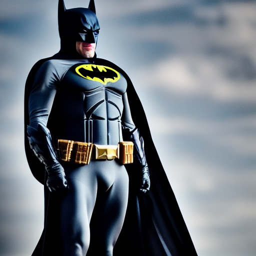
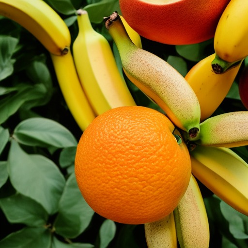
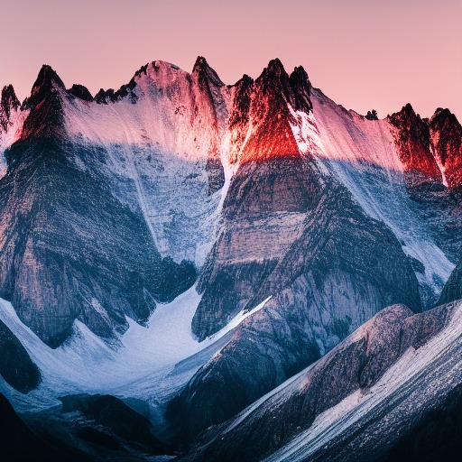
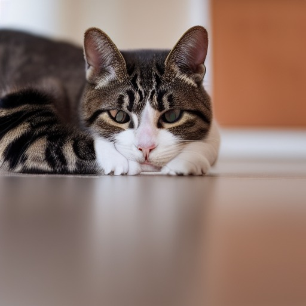

# Stable Diffusion – My Implementation (PyTorch)

This repository contains my implementation and experiments with **Stable Diffusion**,  
based on the open-source project [hkproj/pytorch-stable-diffusion](https://github.com/hkproj/pytorch-stable-diffusion),  
licensed under the **MIT License**.

---

## 🧠 Project Overview
- Implemented and tested locally using **VS Code**.
- Explored **text-to-image generation** using Stable Diffusion in PyTorch.
- Each image below was generated using custom creative prompts.
- Added generated outputs and saved them in the `/results/` folder.

---

## 🖼️ Results

| Prompt Description | Generated Image |
|:--------------------|:----------------|
| **1. Batman Character** `"A realistic Batman standing tall under a cloudy sky, cinematic lighting, ultra-detailed, 8k resolution, hyperrealistic style."` |  |
| **2. Fruits Composition** `"A vibrant composition of bananas, oranges, and peaches on a lush green background, studio lighting, ultra-sharp, 8k resolution, photorealistic style."` |  |
| **3. Mountain Landscape** `"Snow-covered mountains at sunrise, warm light hitting the peaks, highly detailed, dramatic composition, ultra sharp, 8k cinematic landscape."` |  |
| **4. Cat Portrait** `"A cat with sunglasses, wearing comfy hat, looking at camera, highly detailed, ultra sharp, cinematic, 100mm lens, 8k resolution."` |  |

## 🙏 Acknowledgment
This implementation is based on  
[hkproj/pytorch-stable-diffusion](https://github.com/hkproj/pytorch-stable-diffusion).  
All credits for the base implementation go to the original author.  
This repository contains my personal experiments, custom prompts, and generated images.

---

## ⚖️ License
This project follows the **MIT License** from the original repository.  
See the `LICENSE` file for details.
